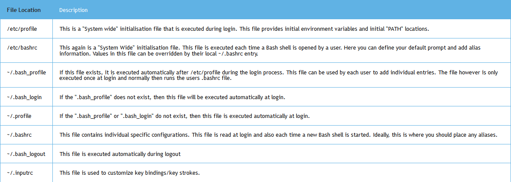

# Bash Reference

This repo is generally very unclean and not maintained.

A Set Of Bash Scripts

## Bash Configuration Files
(from [landoflinux](http://www.landoflinux.com/linux_bash_configuration_files.html))

## Commands

List all files changed in the last 10h, excluding ones in .git dirs.

`find -type f -cmin -600 | grep -v .git`

print lines matching pattern

`sed -n '/^This.*errors.$/p' example`

`sed '2,4d' example`

d remove lines; p only show these lines

find and replace (without g only first match per line)

`sed 's/erors/errors/g' example`

`sed -e 's/erors/errors/g' -e 's/last/final/g' example`

rotate pages

`pdftk mathe.pdf rotate 1-endleft output mathe_new.pdf`

ocr pages

`ocrmypdf mathe_new.pdf mathe_new_new.pdf`

run command in background

`sudo apt update > /dev/null 2>&1 &`

list number of lines in all .cpp files in all subdirectories

`find . -name '*.cpp' | xargs wc -l`

compress pdf

`gs -sDEVICE=pdfwrite -dCompatibilityLevel=1.4 -dPDFSETTINGS=/screen -dNOPAUSE -dQUIET -dBATCH -sOutputFile=physik_31_new.pdf physik_31.pdf`

set default chmod

`find . -type d -exec chmod 755 {} \;`

`find . -type f -exec chmod 644 {} \;`

`cat /etc/os-release`

List processes using mount

`lsof +f -- /path/to/mount`

Kill processes using mount

`fuser -kivm -TERM /path/to/mount`

Better `du`

`ncdu`

Show ip address

`ip -brief address`

Boot into BIOS

`systemctl reboot --firmware-setup`

tldr man pages for `ls`

`tldr ls`

# [Tricks](https://youtu.be/V8EUdia_kOE)

- `sudo !!` re-run with sudo
- `less +F` open file in end
- `ctrl-x-e` open command in EDITOR
- `alt-x` past previous command's argument
- `reset` reset terminal
